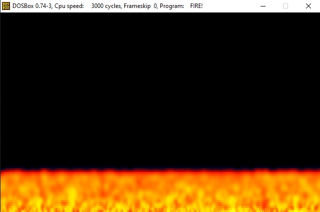
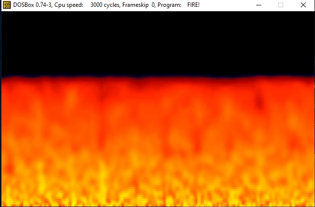
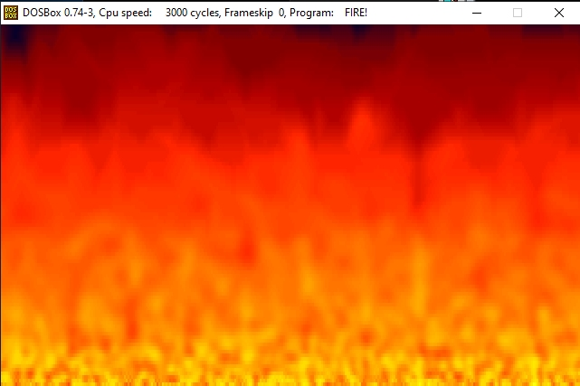

# FireEffect

Fire effects in assembly (asm.x86)

<table width:100%>
  <tr>
    <td></td>
    <td></td>
    <td></td>
  </tr>
</table>

The ".exe" file still should be run well on a DOSBox (in fact that was the way I got these screenshots above). Maybe it's possible to mount .asm for 64 bits if you want ;-).
